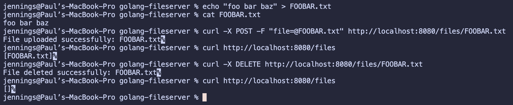

# Simple Golang Fileserver

This is a super simple fileserver written to help me learn Golang.

### Features

This file server supports the following operations on single files:

- Upload a file
- List all files
- Delete a file

The server uses local filesystem storage to persist uploaded files even after the container has been terminated.
Multi-file uploads and directory creation are not yet supported.

### Local Testing

**Setting up the environment**
1. Build the Docker image: `docker build -t golang-filestorage .`
2. Create a local file upload directory if you haven't already: `mkdir uploaded_files`
3. Run the container: `docker run -d -p 8080:8080 -v $(pwd)/uploaded_files:/root/uploaded_files golang-filestorage`
   - Runs the container in the background with port mapping 8080->8080 and a local volume `uploaded_files`

**Uploading a file**  
`curl -X POST -F "file=@path/to/file/FILENAME.txt" http://localhost:8080/files/FILENAME.txt`

**Listing files**  
`curl http://localhost:8080/files`

**Deleting a file**  
`curl -X DELETE http://localhost:8080/files/FILENAME.txt`

### Screenshot of local testing

